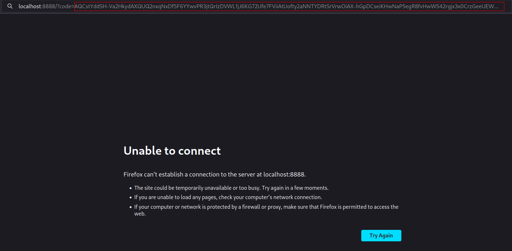

A command line utility that goes through your spotify playlists (your own
playlists and also the ones that you follow) and downloads it's songs metadata
as CSV files. This utility works in Linux, MacOS and FreeBSD.

### Problem
If something ever happens to spotify, all those lists of songs/podcasts/weird
noises you curated over time will go meet the bin.

### Solution
Backup their info using this program. 

_myspotifypl_ creates one CSV file per playlists, the file is named after the
playlist itself. E.g. if the playlist is called "Summer Songs" then it's
corresponding CSV will be "Summer Songs.csv" . For each song inside the
playlist, the CSV will contain it's **title**, the name of it's **album**, the
name of it's **artist**/**band**, the **date in which the song was added to
the playlist** and also the **song's length**.

# Setup

## Step 1: Installing dependencies

For compiling the code, you'll need GCC or Clang (version 12 or higher). You'll
also need libcurl and it's header files. Usually they both come with the
__curl__ package, but the headers might come separately in some __libcurl-dev__
package of sorts depending on your package manager. After installing libcurl,
make sure the `curl.h` header is accessible by the compiler, it'll probably be
in the `/usr/include/curl/` directory.


## <a id=step-2>Step 2: create a spotify developer account and app</a>

To access your account's playlists automatically, you first need to create a
spotify developer account at spotify's [developer
page](https://developer.spotify.com).

Next, create an **app** using your spotify developer account. You can name it
whatever, the app's name doesn't really matter.

Once you have an **app**, go for it's **settings** page and search for the
fields `Client ID` and `Client Secret`. Also add to the `Redirect URIs` field
the URI `http://localhost:8888`. Now copy those three fields into the
`config.c` file inside the _myspotifypl_ project folder. After the copying,
your `config.c` file should look something like this:

```c
#define CLIENT_ID "your_client_id"
#define CLIENT_SECRET "your_client_secret"
#define REDIRECT_URI "http://localhost:8888"
```

Where you'll substitute the `your_client_id` and `your_client_secret` part with
the ones you previously got from your app's settings. It is important that you
keep their values surrounded by double quotes as in the example. Failing to do
so will mess up the next step, where you'll compile the program's code.

NOTE: don't worry about leaving your "client id" and "client secret" inside a
plain text file, this _id_ and _secret_ are only used for this random app that
you created and have nothing to do with your actual spotify account secrets,
like your password.

## Step 3: compile the code

Enter the project's folder through the command line and execute the `build.sh`
script with

```
$ sh build.sh
```

If the compilation worked, you should now see the executable `myspotifypl`
inside the project's folder. If a gigantic, heinous multiple paged error
message appeared as you executed the script, your `config.c` might not be well
formatted and you should go revisit [Step 2](#step-2) of the setup process to
make sure you typed everything correctly inside `config.c`.

To test if the executable is working, call
```
$ ./myspotifypl
```
If everything went well, you should see an error message of the likes of
```
Error: wrong parameters
usage: ./myspotifypl AUTHORIZATION_CODE
link for authorization code:
https://accounts.spotify.com/authorize?client_id=your_client_id_here&response_type=code&redirect_uri=http://localhost:8888&scope=playlist-read-collaborative
```

# Using the program
Finally, to actually use the program after the setup, you'll have to fetch
something called an **"authorization code"** from spotify and pass it as an
argument to the `myspotifypl` executable.

First, call the executable without any arguments.
```
$ ./myspotifypl
```
It will show you a message containing a **link for authorization
code**:
```
Error: wrong parameters
usage: ./myspotifypl AUTHORIZATION_CODE
link for authorization code:
https://accounts.spotify.com/authorize?client_id=your_client_id_here&response_type=code&redirect_uri=http://localhost:8888&scope=playlist-read-collaborative
```

_Notice that you shouldn't copy the above link from this README, it won't work.
The link that shows up after you call the program changes depending on your
`config.c` file._

After getting the link, access it through your web browser. If it's your first
time doing this, you'll be redirected to a page asking for your spotify
credentials for authentication so you can connect to that app created in [Step
1](#step-2) of the setup phase. This one is a delicate step, as you'll be
giving away your password, so to make sure I'm not messing with you check the
current URL of this credentials page to make sure it is really a spotify-owned
domain.

After doing the authetication step (if you had to do authetication at all)
you'll be redirected to a page showing an error and the **authorization code**
will be inside the URI of that page as it's **code** argument, as shown in the
picture below:



Now copy the authorization code from the URI and call the `myspotifypl`
executable again, this time with the authorization code as an argument, e.g. 

```
$ ./myspotifypl 'AQDEdJCafgntEmuIcgMWiGilHUdKUmlo1CAU9-XysytA4ibOZWxt8m8u58Pxy7CWgt1rUElHRHRhbhNGPmFTIglvMZk5BYJZ-uV-hs-2S7uLU1SxR3nrp_4J-fG4-BTqwYG6sT3F4WWizR6V-JpYZVrdzRATH_CAL3WP2BBQkwAPWYCmT4PVj5DDsh4BLHqXMAzSasDJ'
```

This will download your playlists' CSVs inside the current directory. Each time
you want use the `myspotifypl` command, you'll have to generate a new
authorization code by accessing the aforementioned _link for authorization
code_ again.
